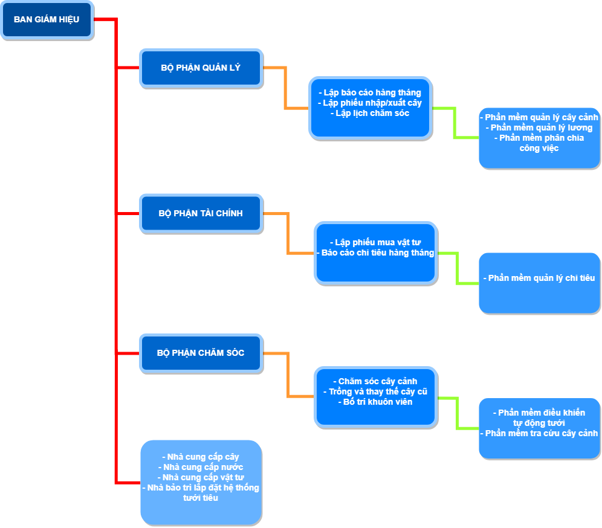
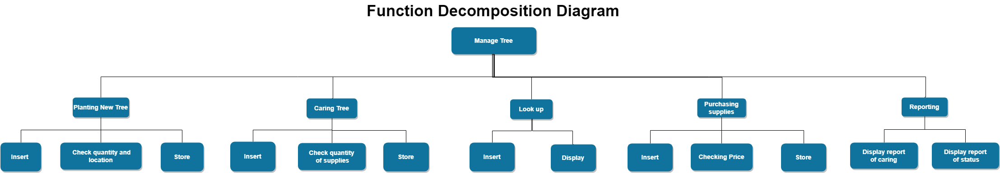
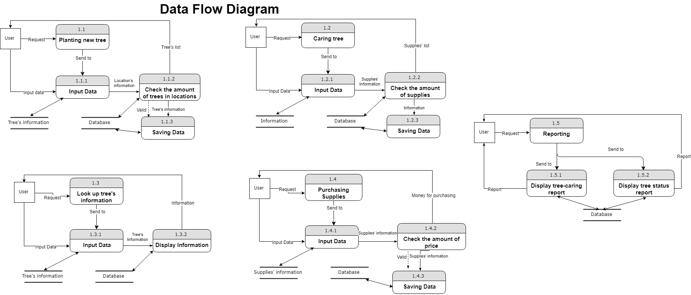
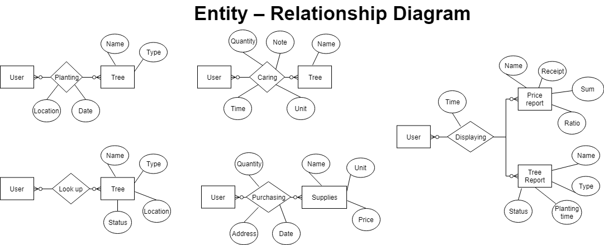
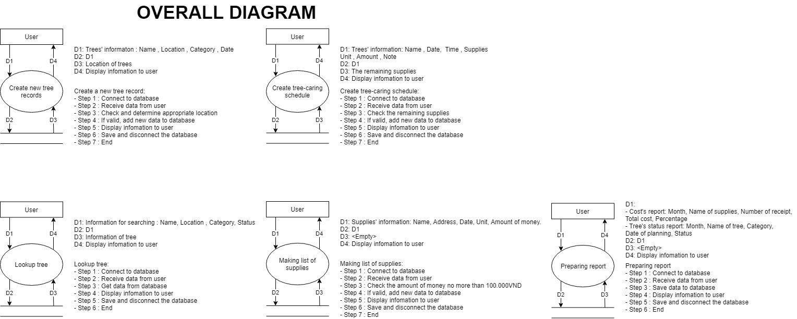

# TREE-MANAGEMENT-AT-SCHOOL

# I. Introduce:
We create a management software to manage tree better. This software can help you management about:
  - Tree :
    + Status 
    + HealthCare
    + Position
    + Plating time
    + Quantity
    + Care Schedule
      
  - Budget:
    + Tree
    + Plant Supplies
    + Report
    
Not only manage, this software also help you create forms to handle easily such as:
  - Planting new tree
  - Care schedule and plant supplies
  - Buying plant supplies
  - Searching status and information
  - Report
  

# II. Build with: 
  - Software was built from:
    + Microsoft Visual Studio - Build the software
    + SQL Server - Manage database
  - Language:
    + C#(Framework .NET)
    + MSSQL
    
# III. Diagram:
  - Situation :

/*  */
  - Function Decomposition Diagram : 

  
/*  */  
  - Data Flow Diagram :

  
/*  */  
  - Entity – Relationship Diagram :

/*  */
  - Overall Diagram :

/*  */
# IV. Functions:
  1. Create new tree records:
  
    Algorithm:
    Step 1 : Connect to database
    Step 2 : Receive data from user
    Step 3 : Check and determine appropriate location
    Step 4 : If valid, add new data to database
    Step 5 : Display infomation to user
    Step 6 : Save and disconnect the database
    Step 7 : End
    
  2. Create tree-caring schedule:
  
    Algorithm:
    Step 1 : Connect to database
    Step 2 : Receive data from user
    Step 3 : Check the remaining supplies
    Step 4 : If valid, add new data to database
    Step 5 : Display infomation to user
    Step 6 : Save and disconnect the database
    Step 7 : End
    
  3. Lookup tree:
  
    Algorithm:
    Step 1 : Connect to database
    Step 2 : Receive data from user
    Step 3 : Get data from database
    Step 4 : Display infomation to user
    Step 5 : Save and disconnect the database
    Step 6 : End
    
  4. Making list of supplies:
  
    Algorithm:
    Step 1 : Connect to database
    Step 2 : Receive data from user
    Step 3 : Check the amount of money no more than 100.000VND
    Step 4 : If valid, add new data to database
    Step 5 : Display infomation to user
    Step 6 : Save and disconnect the database
    Step 7 : End
    
  5. Preparing report:
  
    Algorithm:
    Step 1 : Connect to database
    Step 2 : Receive data from user
    Step 3 : Save data to database
    Step 4 : Display infomation to user
    Step 5 : Save and disconnect the database
    Step 6 : End

# V. Example:   
# VI. FAQ & Usage:
# VII. Contributing:
# IV. Authors:
  - Tống Anh Quân _ 16520985
  - Bùi Trung Điền _ 16521554 
  - Nguyễn Đông Quân _ 16520982
